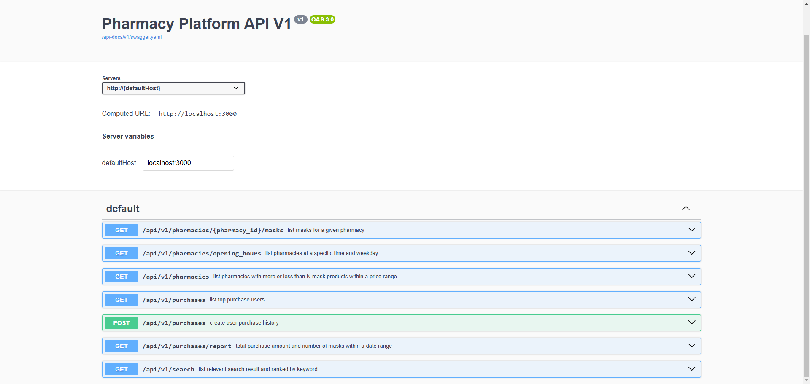

# Response

## A. Required Information
### A.1. Import Data Commands

Completed commands for running seed data (pharmacies.json and users.json) into the database.

### A.2. Requirement Completion Rate
- [x] List all pharmacies open at a specific time and on a day of the week if requested.
  - Implemented at `/api/v1/pharmacies/opening_hours` API.
- [x] List all masks sold by a given pharmacy, sorted by mask name or price.
  - Implemented at `/api/v1/pharmacies/{pharmacy_id}/masks` API.
- [x] List all pharmacies with more or less than x mask products within a price range.
  - Implemented at `/api/v1/pharmacies` API.
- [x] The top x users by total transaction amount of masks within a date range.
  - Implemented at `/api/v1/purchases` API.
- [x] The total number of masks and dollar value of transactions within a date range.
  - Implemented at `/api/v1/purchases/report` API.
- [x] Search for pharmacies or masks by name, ranked by relevance to the search term.
  - Implemented at `/api/v1/search` API.
- [x] Process a user purchases a mask from a pharmacy, and handle all relevant data changes in an atomic transaction.
  - Implemented at `/api/v1/purchases` API.

### A.3. API Document

We use swagger as the API documentation. Once you run the Rails application, visit http://localhost:3000/api-docs/index.html to check out all API endpoints.



## B. Bonus Information

### B.1. Test Coverage Report

I wrote down the 30 automated tests, including unit tests and request tests.

You can run the test script by using the command below:

```bash
$ make bash
$ rspec spec

# or

$ make test
```

### B.2. Dockerized
On the local machine, please follow the commands below to build it.

```bash
$ docker-compose up -d

# go inside the container, run the migrate data command.

$ cd pharmacy_backend
$ make bash
$ rake import_data:pharmacies["db/seeds/pharmacies.json"]
$ rake import_data:users["db/seeds/users.json"]
```
